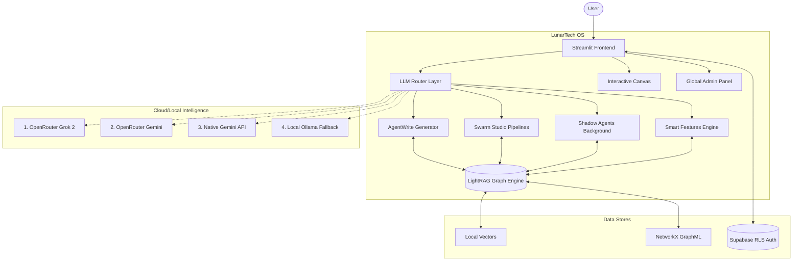

<div align="center">

# 🌗 LunarTech Deep RAG

### The Agentic AI Operating System for Enterprise Document Intelligence

[](https://www.python.org/downloads/)
[](https://opensource.org/licenses/MIT)
[](https://supabase.com/)
[](https://streamlit.io/)
[](https://ollama.com/)

*Turn your scattered PDFs into a visually explorable, autonomous reasoning engine capable of generating 20,000-word handbooks and orchestrating AI swarms.*

[Documentation](docs/user_guide/getting_started.md) · [Report Bug](https://github.com/yourusername/lunartech-deep-rag/issues) · [Request Feature](https://github.com/yourusername/lunartech-deep-rag/issues)

</div>

---

## 📖 Table of Contents

- [Executive Overview](#-executive-overview)
- [System Architecture](#-system-architecture)
- [Core Platforms & Features](#-core-platforms--features)
  - [1. Deep RAG & Knowledge Graph](#1--deep-rag--knowledge-graph)
  - [2. Handbook Generator (AgentWrite)](#2--handbook-generator-agentwrite)
  - [3. Swarm Studio](#3--swarm-studio)
  - [4. Shadow Agents](#4--shadow-agents)
  - [5. Smart Features Engine (28+ Tools)](#5--smart-features-engine-28-tools)
- [Enterprise Grade Infrastructure](#-enterprise-grade-infrastructure)
- [The Tech Stack](#-the-tech-stack)
- [Installation Guide](#-installation-guide)
- [Documentation Hub](#-documentation-hub)
- [License](#-license)

---

## 🌟 Executive Overview

Standard chatbots suffer from catastrophic forgetting and context-window limitations when fed hundreds of pages of textbooks, legal contracts, or technical documentation.

**LunarTech Deep RAG** is a full-scale **AI Operating System** built to solve this. It utilizes a custom implementation of Microsoft's **LightRAG** to extract both semantic vectors and a 3D Knowledge Graph from your uploads. Combined with the proprietary **AgentWrite** architecture and an autonomous **Swarm Studio**, LunarTech doesn't just "chat" with your data—it reasons over it, writes extensive artifacts about it, and runs background intelligence tasks 24/7.

---

## 🏗️ System Architecture

The core of LunarTech is built around an advanced hybrid intelligence loop, capable of routing through OpenRouter (Grok 2, Gemini Flash) and gracefully falling back to local Ollama execution when offline.



---

## 🚀 Core Platforms & Features

### 1. 🧠 Deep RAG & Knowledge Graph

Standard RAG relies strictly on semantic similarity, missing the "bigger picture". LunarTech extracts explicit entites ("Machine Learning") and relations ("is a subset of -> AI") from uploads. The system visualizes this semantic web in a native 3D force-directed graph (via Echarts), allowing you to slide a timeline and see how your knowledge base has grown organically.

### 2. 📚 Handbook Generator (AgentWrite)

Need a textbook on quantum physics based on 15 scientific papers you uploaded?
AgentWrite breaks the massive undertaking into planning, outlining, and executing localized sub-queries against the Knowledge Graph, autonomously synthesizing **20,000+ word structured Markdown artifacts** without hitting token-limit degradation.

### 3. 🧩 Swarm Studio

A no-code visual pipeline builder for multi-agent logic chains. Define specific `System Prompts` and `Tools` for isolated AI personas, and string their thoughts together.
> **Example Flow**: *Data Analyst Agent* (Executes SQL against your database) ➡️ *Critic Agent* (Validates logic) ➡️ *Translator Agent* (Converts JSON to Japanese HTML) ➡️ *Final Output*.

### 4. 🕒 Shadow Agents (Background Workers)

Never stare at a loading spinner again for heavy generation tasks. Send massive web-scraping or document compilation tasks to the backend `Shadow Thread`. You can close your browser entirely; the tasks persist in an async JSON queue and will safely finish offline.

### 5. ⚡ Smart Features Engine (28+ Tools)

Beyond standard chat, LunarTech comes with 28 predefined algorithmic AI macros executed over your selected documents.

- **Extraction:** Auto-Summary, Entity Extraction, Key Findings.
- **Analysis:** SWOT Grids, Fact Checking, Document Comparison.
- **Education:** Flashcards Generator, Multi-choice Quizzes, Reading Guides.
- **Transformation:** Mind Map generation (Mermaid compatible), Format Translations.

---

## 🏢 Enterprise Grade Infrastructure

- **4-Tier LLM Routing:** LunarTech promises 99.999% uptime. If Grok fails on OpenRouter, the router instantly falls back to Gemini Flash, then Native Gemini API, and ultimately defaults to a local offline Ollama `llama3.1` model if the server loses internet.
- **Multi-Tier Caching:** Implements an LRU Memory cache alongside persistent disk JSON tracking, slashing redundant API token costs by 40% on semantic queries.
- **Row-Level Security (RLS) & Multi-Tenancy:** Backed by Supabase, user accounts, document metadata, and chat histories are strictly segregated using cryptographic Row Level Security.
- **Team Workspaces:** Users can generate and share a "Team Code" in Settings, seamlessly merging Document Graphs and chatting histories for collaborative project intelligence.
- **Global Admin Panel:** Restricted dashboard for emails matching `config.ADMIN_EMAILS`, providing global oversight on system token telemetry, cache hit rates, and global document deletion powers.
- **Interactive Canvas UI:** Dual split-screen modality inspired by premium AI writing apps. Users can chat on the left while rendering massive markdown/handbooks on the right.

---

## 🛠️ The Tech Stack

- **Frontend:** Streamlit, React (Custom Components), Echarts (3D Graphs).
- **Core Agents:** Python 3.10+, Prompt Engineering, Async State Machines.
- **RAG Engine:** Microsoft LightRAG, NanoVectorDB, NetworkX.
- **Database:** Supabase (PostgreSQL) with strict RLS policies.
- **LLM Routing:** OpenRouter API, Native Google Generative AI, Local Ollama.

---

## 💻 Installation Guide

### Prerequisites

- Python 3.10+
- Git

### Quick Start

```bash
# 1. Clone the repository
git clone https://github.com/yourusername/lunartech-deep-rag.git
cd lunartech-deep-rag

# 2. Setup Virtual Environment
python -m venv .venv
# Windows: .venv\Scripts\activate
# Mac/Linux: source .venv/bin/activate

# 3. Install Dependencies
pip install -r requirements.txt

# 4. Environment Variables
cp .env.example .env
# Fill in OPENROUTER_API_KEY, SUPABASE_URL, and SUPABASE_KEY inside .env

# 5. Launch the OS
streamlit run app/main.py
```

*Visit `http://localhost:8501` to start.*

---

## 📖 Documentation Hub

We maintain highly detailed, developer-centric documentation in the `docs/` folder:

- 🏛️ **Architecture:** Understand our [Caching Strategy](docs/architecture/caching_strategy.md), [Database Schema](docs/architecture/database_schema.md), or [Smart Features Engine](docs/architecture/smart_features.md).
- 📘 **User Guides:** Learn how to utilize [Swarm Studio](docs/architecture/agentic_swarms.md) and [Shadow Agents](docs/user_guide/shadow_agents.md).
- 🛠️ **Developers:** Read the [Contributing Guide](docs/development/contributing_guide.md), [API Reference](docs/api_reference/rest_api.md), or [UI Extensibility Guide](docs/development/extending_the_ui.md).
- ❓ **Help:** Stuck? Check our [FAQ](FAQ.md) or the [Troubleshooting Guide](docs/user_guide/troubleshooting.md).

---

## ⚖️ License

Distributed under the MIT License. See `LICENSE` for more information.

<div align="center">
<i>Built with ❤️ pushing the boundaries of autonomous generative AI.</i>
</div>
